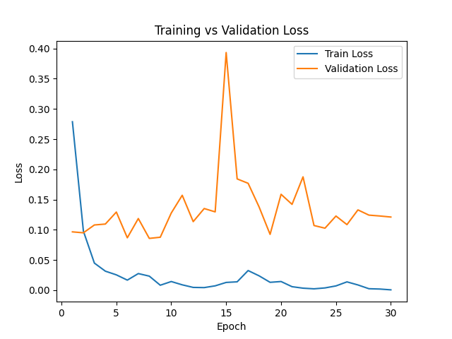
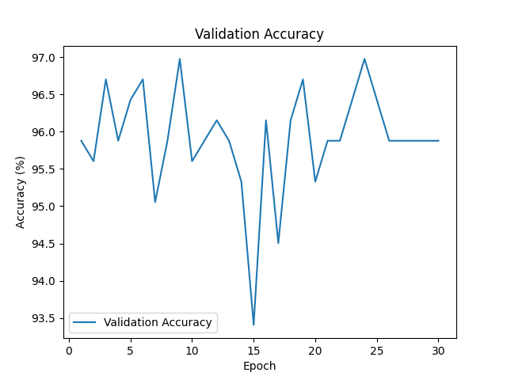

# 🌸 Flower Image Classifier (PyTorch + ResNet18)


A deep learning project that classifies flower images using a pretrained **ResNet18** model fine-tuned on a custom dataset.

This project demonstrates transfer learning, modular PyTorch structure, model checkpointing, visualization, and inference.

---

## 🚀 Features

- ✅ Transfer Learning with ResNet18
- ✅ Data Augmentation
- ✅ Dropout Regularization
- ✅ Best Model Checkpointing
- ✅ Metrics Tracking & Visualization
- ✅ Single Image Prediction
- ✅ Apple Silicon (MPS) Support
- ✅ Modular Project Structure

---

## 🧠 Model Architecture

- Base Model: **ResNet18 (ImageNet pretrained)**
- Dropout: 0.4
- Loss Function: CrossEntropyLoss
- Optimizer: Adam
- Input Size: 224×224

---

## 📊 Performance

- Validation Accuracy: **~96–97%**
- Mild overfitting controlled using:
  - Data augmentation
  - Dropout
  - Best model saving

---

## 📈 Training Loss Curve




## 📊 Validation Accuracy Curve



---

## ⚙️ Installation

Create environment:

```bash
conda create -n flower_env python=3.11
conda activate flower_env
Install dependencies:

```bash
pip install -r requirements.txt
```

---

## 🏋️ Train the Model

```bash
python src/train.py
```

This will:
- Train the model
- Save best weights to `saved_models/best_model.pth`
- Save metrics to `saved_models/metrics.pt`

---

## 📊 Visualize Training

```bash
python src/visualize.py
```

Generates:
- Training vs Validation Loss graph
- Validation Accuracy graph

---

## 🔍 Predict on New Image

Edit image path inside `predict.py`, then run:

```bash
python src/predict.py
```

---

## 📁 Project Structure

```
Flower_Classifier/
├── data/
├── saved_models/
├── outputs/
├── src/
├── requirements.txt
├── README.md
└── .gitignore
```

---

## 📦 Dependencies

- torch  
- torchvision  
- numpy  
- matplotlib  
- pillow  
- scikit-learn  

---

## 👤 Author

**Bimal Kumal**  
ML, Deep Learning & Computer Vision Enthusiast